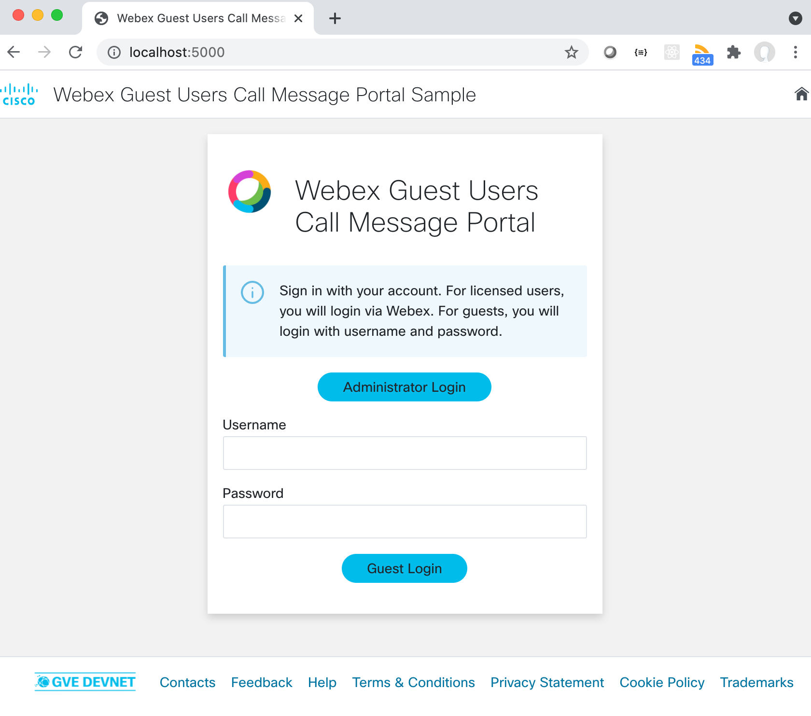
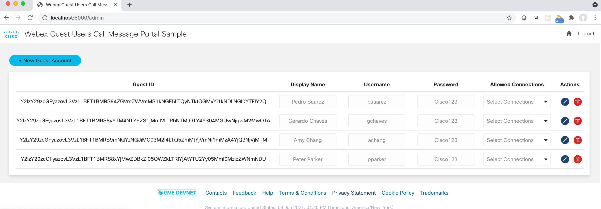
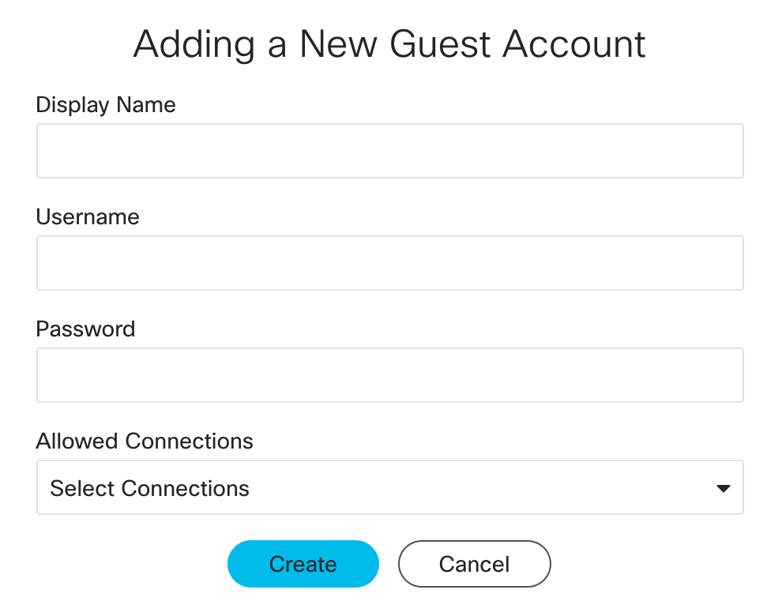
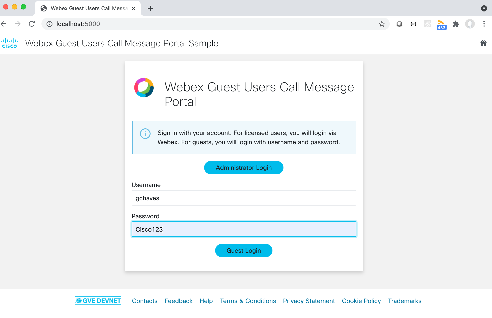
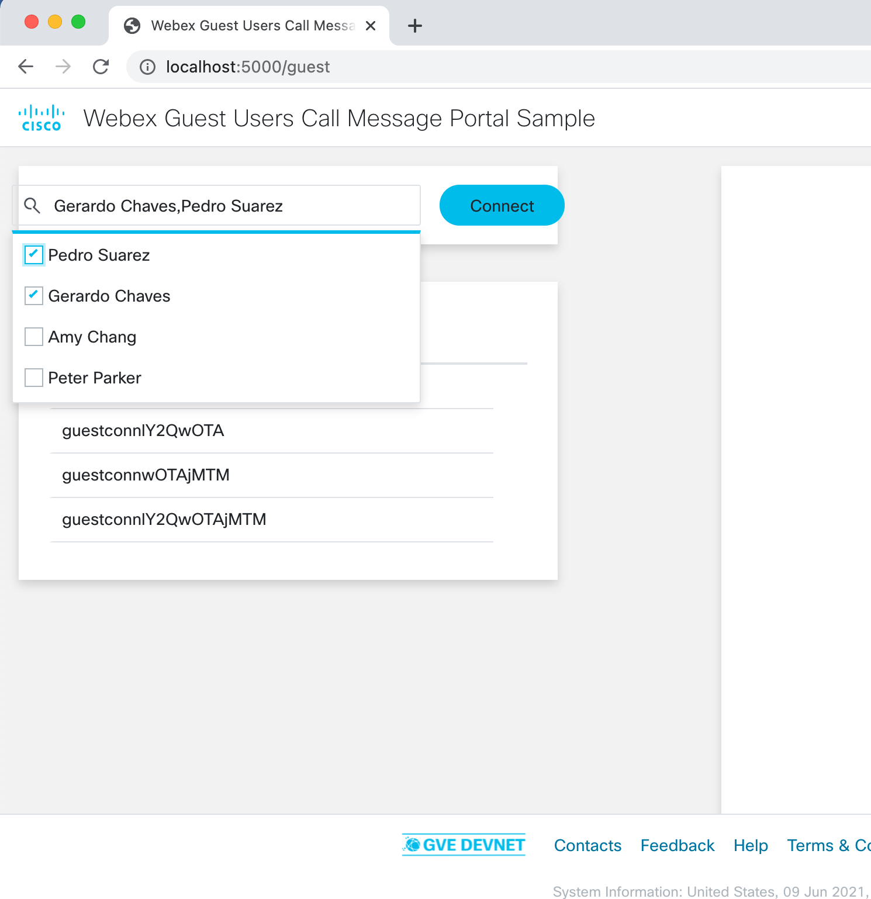
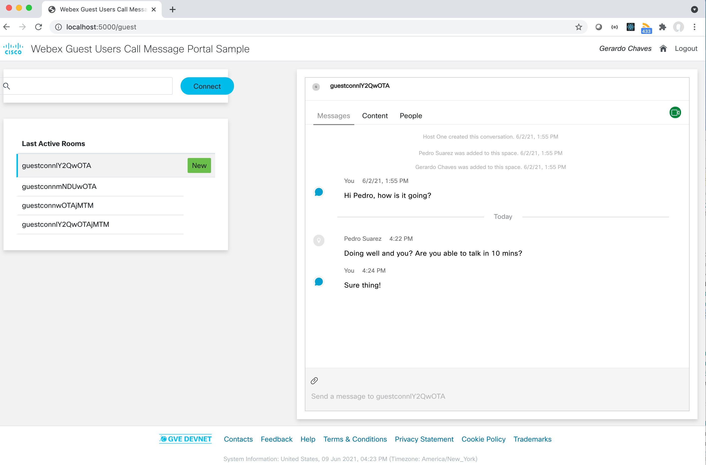
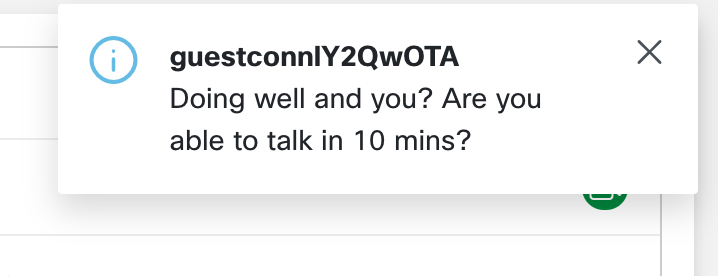
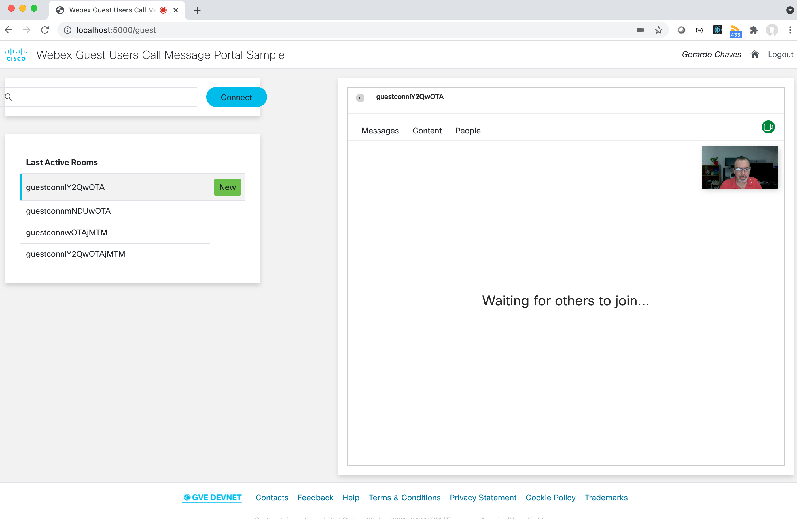
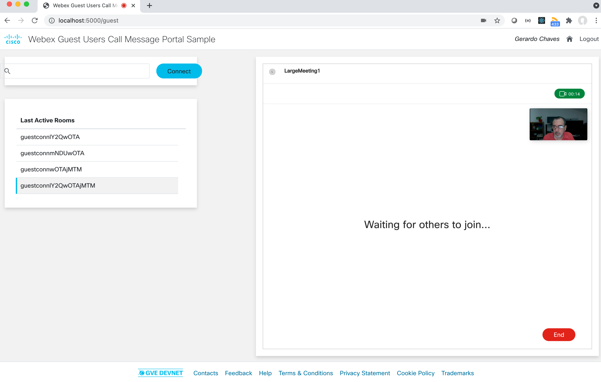

# Webex Guest Users Calling and Messaging Portal sample

This sample shows how to create a web portal that allows and organization to have Webex Guest Token users log in and message/meet 
with other Guest Token users all under the control of full Webex accounts so that there is total control of who can message/meet with whom.  

## Contacts
* Gerardo Chaves (gchaves@cisco.com)
* Alvin Lau (alvlau@cisco.com)

## Solution Components
* Webex Meetings and Messaging
* Webex Browser SDK
* Webex Widgets


## Installation/Configuration

It is recommended to set up your environment as follows to use this sample:

In the CLI:
1.	Choose a folder, then create and activate a virtual environment for the project
    ```python
    #WINDOWS:
    py -3 -m venv [add name of virtual environment here] 
    source [add name of virtual environment here]/Scripts/activate
    #MAC:
    python3 -m venv [add name of virtual environment here] 
    source [add name of virtual environment here]/bin/activate
    ```

2. Access the created virtual enviroment folder
    ```python
    cd [add name of virtual environment here] 
    ```

3.	Clone this Github repository into the virtual environment folder.
    ```python
    git clone [add github link here]
    ```
    For Github link: 
        In Github, click on the **Clone or download** button in the upper part of the page > click the **copy icon**
         

4. Access the folder you just created when cloning
    ```
    cd GVE_Devnet_Webex_GuestUsers_Call_Message_Portal_Sample
    ```

5.	Install dependencies
    ```python
    pip install -r requirements.txt
    ```

6. Creating a Webex Teams Guest Issuer Authority to configure the guest shared secret

For this sample, the end user will be a Webex Teams Guest User.
This user is a dynamically created user that does not require an existing Webex Teams account to utilize Webex Teams services.
To be able to create these Guest Users, you will need to create a "Guest Issuer" account on the Webex for Developers portal.

- Login to the Webex for Developers site at <https://developer.webex.com>

  - Once logged in, click on "My Webex Teams Apps" under your profile at the top
  - Click "Create a New App" button
  - Click "Create a Guest Issuer"
  - Choose a name, example: "ACME Company Webex Guests"
  - Note: Free users cannot create guest issuers (request a demo account from any Cisco representative or a Cisco Partner)  

Be sure to note the Guest Issuer Name, Guest Issuer ID and Guest Issuer Shared Secret provided when you created the guest issuer authority to use in the next step.   

7. Create a [Webex Integrations](https://developer.webex.com/docs/integrations) as per instructions in that link. You will need to note the Client ID and 
CLient Secret generated there. 


8. Copy the `.env.default` file to `.env` 
```
cp .env.default .env
```
Edit `.env` and fill out the requested values:  

`GUEST_ISSUER_ID`: Specified when creating the Guest Issuer Authority described above.  
`GUEST_SHARED_SECRET`: This is the Guest Issuer Shared Secret obtained when creating the Guest Issuer Authority described above.  
`GUEST_TOKEN_EXPIRATION`: Time in seconds the guest token should be valid for. The default value  in the samle is 5400 seconds or 90 minutes which is usually enough for a regular tele-consultation or to have the guest join a meeting that lasts 1 hour (in case of extension)
`CLIENT_ID`: This is Client ID from the integration you created above.
`CLIENT_SECRET`: This is the Client Secret from the integration you created above.

Also, in the `app.py` file, configure the following variable:

**PUBLIC_URL**
Set PUBLIC_URL to the URL where your instance of this Flask application will run. If you do not change the parameters 
of app.run() at the end of the app.py file, this should be the same value of 'http://localhost:5000' that is set by default 
in the sample code.  
NOTE: This URL does not actually have to map to a public IP address out on the internet. 

9. Populate the `largespaces.json` file with the id, name and ownerID of as many spaces owned by licensed Webex Meetings users as the number of concurrent large meetings 
you expect to handle in the sample application. Leave the "busy" fields for all as "false" and the "borrowing_space_id" empty since these are managed by the code. 
The values set in this file are just a starting point for the application, the file is not written back to the file system so if you stop the application, all reservations will be reset,  but the code does "clean up" large spaces to use before re-using them (removes temporary members )


## Usage

    $ python app.py

Once the flask app is running, go the main page (i.e. http://localhost:5000) and select the Administrator Login button. 



If this is the first time running the 
application, you will be re-directed to the login page of the Webex organization you are using to start and oAuth flow and then will be re-directed to the 
Admin page. 
Since the authentication and refresh tokens are stored locally in the **tokens.json** file, you can use the application without having to 
re-authenticate for as long as you want as long as you refresh any expired tokens at least once every 60 days. This refresh is done 
automatically when you try to use the application to access the main page with the Spaces dropdown, but you can also use 
the /refresh route to force refreshing of the token. 

NOTE: clear out the **tokens.json** file when you are done using the sample so they are not left insecured in the test server. 
When creating production code using this sample as a reference, be sure to store in a more secure manner and fully encrypted.  

NOTE: For audio/video communications to work using the Webex Widgets and eventually the Webex SDK, you must connect to the web server using 
https or localhost (i.e. localhost:500 or https://0.0.0.0:5000). There are many articles on the web on how to enable HTTPS for Flask servers,
but you are better off simply not using the Flask built-in server since it is not suitable for production. This section of the Flask documentation 
gives details on the various options to Deploy Flask for production with full security enabled: https://flask.palletsprojects.com/en/0.12.x/deploying/


You will be presented with a page where you can add new guest users using the "+ New Guest Account" button on the top left. 




After you have created at least 2 guest users, go back to the login page by clicking on the "Logout" or Home button on the top right. 

Back in the main login screen, enter the username and password for one of the guest users you created and click on "Guest Login"



You will be presented with a "List Active Rooms" section which will be initially empty. To create rooms with other users, click on the magnifier glass 
on the top left , select at least 2 users (including yourself) and click on Connect.  This will create the new room and refresh the page to show it in the 
"Last Active Rooms" column on the left.



NOTE: If you have not logged in for the first time on the application and the **tokens.json** file is not present or the token is expired beyond 
the refresh period, you will get taken back to the login page with an error message to contact the administrator and have them log into the application. 

Now click on the room and a Webex Gadget will be presented where you can chat and meet with the other user(s) in that space.



While you have a guest page open, if you receive a message, a toaster notification will show on the upper right alerting 
you of the message.  



To initiate a call in the space, click on the green button on the upper right and then on the call button within 
the Gadget



If the space selected to try and call into has more than 2 participants plus the "AppAdmin", the backend code will reserve 
a space that belongs to a fully licensed Meetings User specified in the ```largespaces.json``` file and use that temporarily 
for the meeting. To be able to "release" that room, you need to click on the End button on the bottom right of the widget. 



This usage of the red "End" button is only needed in for meetings in those "large" spaces that have more than 2 Guest Token users given 
the licensing limitations where Guest Token users should not call each other directly or host meetings with more than 
3 participants. 

### LICENSE

Provided under Cisco Sample Code License, for details see [LICENSE](LICENSE.md)

### CODE_OF_CONDUCT

Our code of conduct is available [here](CODE_OF_CONDUCT.md)

### CONTRIBUTING

See our contributing guidelines [here](CONTRIBUTING.md)

#### DISCLAIMER:
<b>Please note:</b> This script is meant for demo purposes only. All tools/ scripts in this repo are released for use "AS IS" without any warranties of any kind, including, but not limited to their installation, use, or performance. Any use of these scripts and tools is at your own risk. There is no guarantee that they have been through thorough testing in a comparable environment and we are not responsible for any damage or data loss incurred with their use.
You are responsible for reviewing and testing any scripts you run thoroughly before use in any non-testing environment.